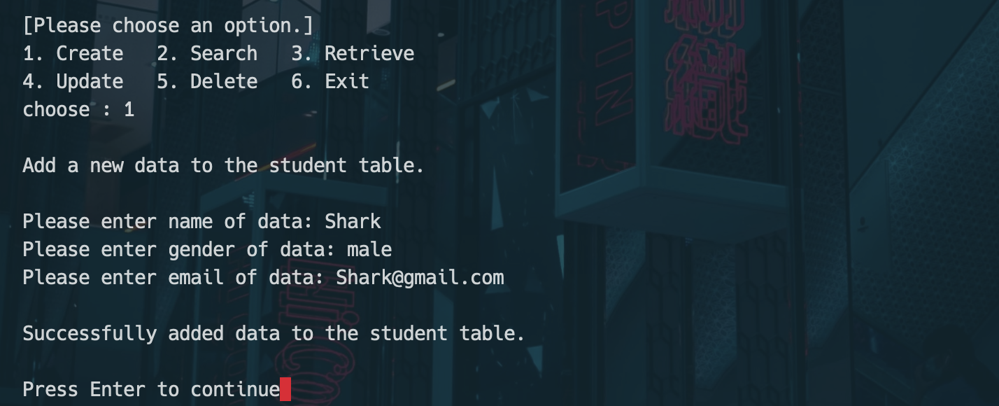
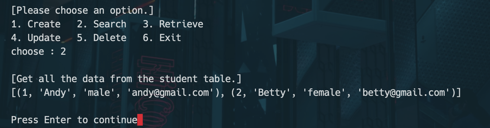
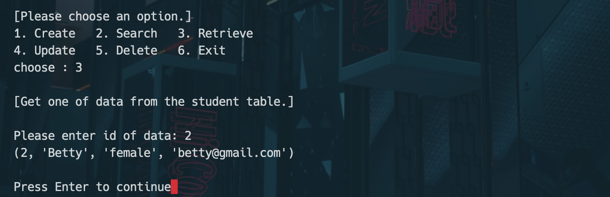
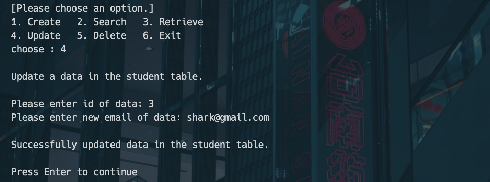
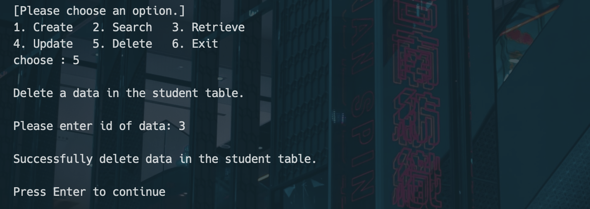
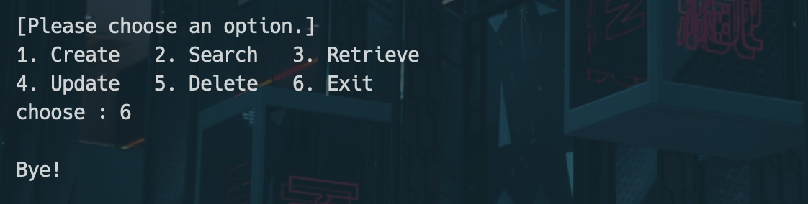

# 資料庫資訊
| IP             | Port | Database | Table   | Column                  |
|----------------|------|----------|---------|-------------------------|
| 163.23.148.150 | 3306 | studydb  | student | Id, Name, Gender, Email |

# 用戶資訊

| 帳號   | 密碼       |
|------|----------| 
| test | Test543! |

# 如何執行專案？
1. 下載 [專案.zip](https://github.com/sharkfoolish/remote-database/archive/refs/heads/main.zip) 然後解壓縮
2. 先用終端機 cd 到專案資料夾中
3. `pip install mysql-connector-python`
4. `python __main__.py`

# 功能列表
：提供一個 command-line 介面，用指令的方式遠端操控資料庫
- 新增一個學生資料（姓名、性別、電子郵件）

- 查詢所有學生資料

- 查詢單個學生資料（Id)

- 更新某位學生的電子郵件（Id、電子郵件）

- 刪除某位學生的資料（Id)

- 離開

